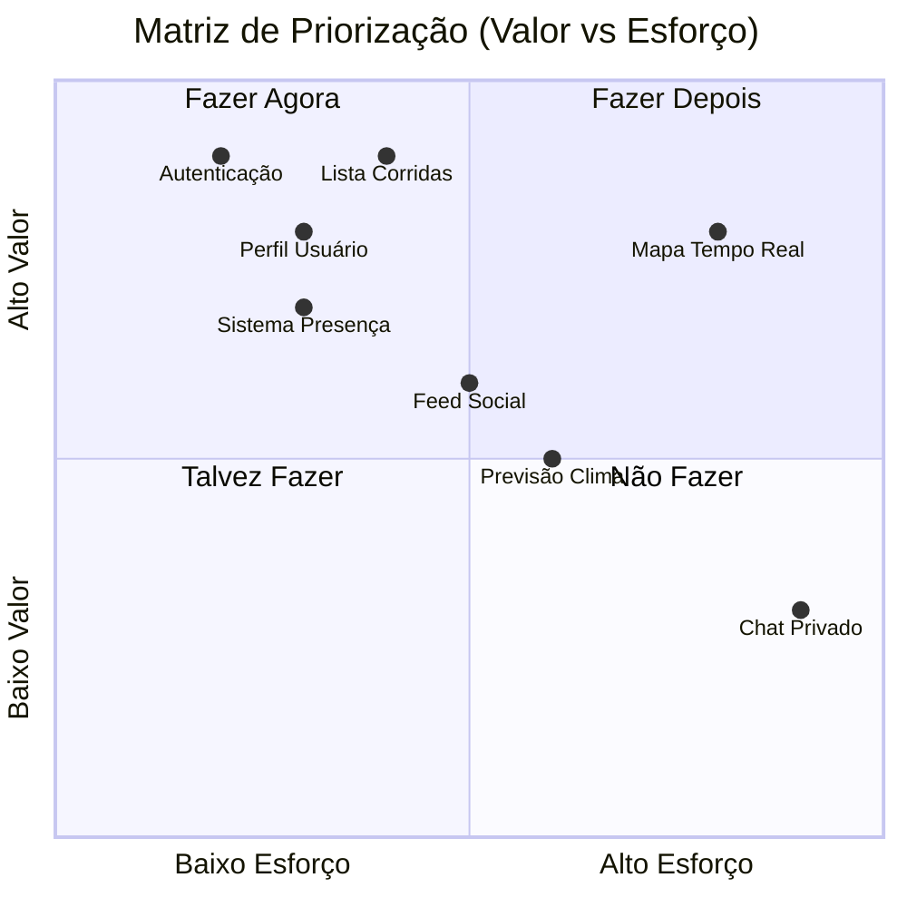
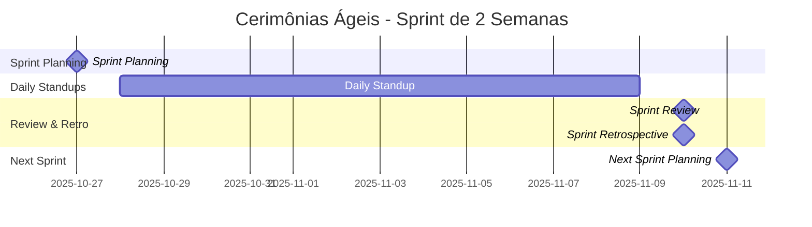
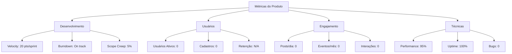
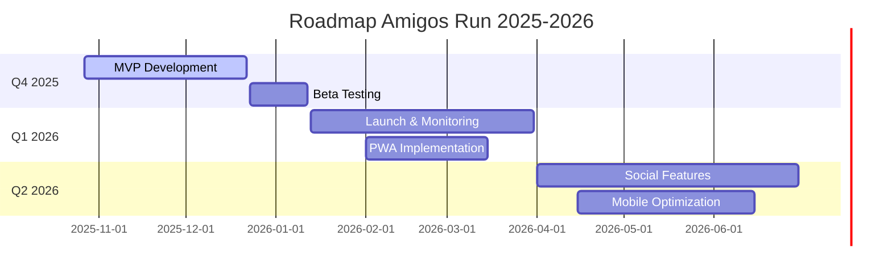

# Amigos Run - Product Backlog

## Product Backlog - Plataforma Web de Corridas Sociais

[🎯 Sprint Atual](#-sprint-atual) • [📋 Backlog](#-backlog-de-funcionalidades) • [🐛 Bugs](#-backlog-de-bugs) •
[🔧 Melhorias](#-backlog-de-melhorias-técnicas) • [💡 Icebox](#-icebox---ideias-futuras) • [📊 Métricas](#-métricas-e-kpis)

---

## 📝 Informações do Projeto

### Dados Básicos

| Campo | Valor |
|-------|-------|
| **Nome do Projeto** | Amigos Run |
| **Product Owner** | Dalila Rodrigues |
| **Scrum Master** | Dalila Rodrigues |
| **Tech Lead** | Dalila Rodrigues |
| **Sprint Atual** | Sprint 1 |
| **Versão Atual** | v0.1.0 (MVP) |
| **Próxima Release** | v1.0.0 |
| **Data da Release** | 19/01/2026 |

### Contexto do Produto

#### Visão do Produto
> Plataforma web social que centraliza eventos de corrida, conecta corredores e fornece informações práticas em tempo real (clima, localização, interação social).

#### Objetivos Estratégicos
- **Conectar corredores**: Criar comunidade ativa de corredores
- **Centralizar eventos**: Hub único para descoberta de corridas
- **Informações práticas**: Clima e localização em tempo real
- **Engajamento social**: Interação entre participantes

#### Personas Principais
- **Corredor Iniciante**: Busca eventos adequados ao nível
- **Corredor Experiente**: Quer descobrir novos eventos e networking
- **Organizador**: Precisa divulgar eventos e aumentar participação

---

## 🎯 Sprint Atual

### Sprint 1 - Autenticação e Perfil (27/10 - 10/11/2025)

#### Objetivo da Sprint
> Implementar sistema de autenticação seguro e perfil completo do usuário para estabelecer a base da plataforma.

#### Capacidade da Sprint
- **Velocity Estimada**: 20 pontos
- **Pontos Comprometidos**: 18 pontos
- **Pontos Concluídos**: 13 pontos
- **Utilização**: 72% (13/18)

### 🔴 Itens Críticos

#### AUTH-001: Sistema de Autenticação com Email

**Status**: ✅ Concluído
**Estimativa**: 8 pontos
**Assignee**: Dalila Rodrigues
**Epic**: Autenticação
**Labels**: auth, firebase, security

**Descrição**: Como usuário, eu quero fazer login com email e senha para acessar a plataforma de forma segura.

**Critérios de Aceitação**:
- [x] Cadastro com email e senha
- [x] Login com credenciais válidas
- [x] Confirmação obrigatória por email
- [x] Logout funcional
- [x] Validação de email único
- [x] Mensagens de erro claras

**Tarefas Técnicas**:
- [x] Configurar Firebase Auth
- [x] Criar componente LoginForm.vue
- [x] Implementar RegisterForm.vue
- [x] Adicionar validação de formulários
- [x] Configurar redirecionamentos
- [x] Criar composable useAuth.js

**Arquivos Implementados**:
- authService.js
- LoginForm.vue
- RegisterForm.vue
- firebase-config.js
- useAuth.js
- .env (configurado)

#### PROFILE-002: Perfil Completo do Usuário

**Status**: ✅ Concluído
**Estimativa**: 5 pontos
**Assignee**: Dalila Rodrigues
**Epic**: Perfil de Usuário
**Labels**: profile, firebase, avatar

**Descrição**: Como usuário, eu quero gerenciar meu perfil completo para me apresentar à comunidade.

**Critérios de Aceitação**:
- [x] Sistema de avatar gerado + URL externa
- [x] Campos: nome, peso, altura, meta, biografia
- [x] Validação de dados obrigatórios
- [x] Preview do avatar
- [x] Edição de dados existentes
- [x] Visualização do perfil público

**Arquivos Implementados**:
- avatarService.js
- userService.js
- ProfileForm.vue
- Profile.vue

**Valor de Negócio**: Alto - Base para interação social
**Impacto no Usuário**: Essencial para personalização

#### PROFILE-003: Visualização de Perfil Público

**Status**: 📋 Backlog
**Estimativa**: 3 pontos
**Assignee**: Dalila Rodrigues

**Descrição**: Como usuário, eu quero visualizar perfis de outros corredores para conhecer a comunidade.

**Critérios de Aceitação**:
- [ ] Página de perfil público
- [ ] Dados visíveis: foto, nome, biografia, corridas inscritas
- [ ] Dados privados: peso, altura (opcionais)
- [ ] Link compartilhável do perfil

#### LAYOUT-004: Layout Base da Aplicação

**Status**: 📋 Backlog
**Estimativa**: 2 pontos
**Assignee**: Dalila Rodrigues

**Descrição**: Como usuário, eu quero uma interface consistente e responsiva para navegar facilmente.

**Critérios de Aceitação**:
- [ ] Header com navegação
- [ ] Menu responsivo
- [ ] Footer informativo
- [ ] Design system básico
- [ ] Compatibilidade mobile

---

## 📋 Backlog de Funcionalidades

### Matriz de Priorização

### Épicos Planejados

#### Epic 1: Autenticação e Perfil (Sprint 1)

**Objetivo**: Estabelecer base de usuários com autenticação segura e perfis completos
**Valor de Negócio**: Fundação da plataforma
**Estimativa Total**: 18 pontos
**Timeline**: Sprint 1

**Histórias Incluídas**:
- AUTH-001: Sistema de Autenticação - 8 pontos
- PROFILE-002: Perfil Completo - 5 pontos
- PROFILE-003: Perfil Público - 3 pontos
- LAYOUT-004: Layout Base - 2 pontos

#### Epic 2: Gestão de Corridas (Sprint 2)

**Objetivo**: Permitir cadastro, visualização e gestão de eventos de corrida
**Valor de Negócio**: Core da plataforma
**Estimativa Total**: 22 pontos
**Timeline**: Sprint 2

**Histórias Incluídas**:
- CORRIDA-005: Cadastrar Corrida - 8 pontos
- CORRIDA-006: Listar Corridas - 5 pontos
- CORRIDA-007: Calendário Mensal - 5 pontos
- WEATHER-008: Previsão do Tempo - 4 pontos

#### Epic 3: Interação Social (Sprint 3)

**Objetivo**: Implementar recursos sociais para engajamento da comunidade
**Estimativa Total**: 20 pontos
**Timeline**: Sprint 3

**Histórias Incluídas**:
- SOCIAL-009: Sistema Vou/Não Vou - 8 pontos
- FEED-010: Feed de Interação - 8 pontos
- NOTIF-011: Notificações Visuais - 4 pontos

#### Epic 4: Mapa e Localização (Sprint 4)

**Objetivo**: Adicionar funcionalidades de mapa e localização em tempo real
**Estimativa Total**: 25 pontos
**Timeline**: Sprint 4

**Histórias Incluídas**:
- MAP-012: Mapa com Leaflet - 10 pontos
- LOCATION-013: Localização Tempo Real - 10 pontos
- MAP-014: Marcadores de Eventos - 5 pontos

### Backlog Priorizado

#### 🔴 Críticas (Sprint 2)

| ID | Título | Estimativa | Epic | Valor |
|----|--------|------------|------|-------|
| CORRIDA-005 | Cadastrar Nova Corrida | 8 pts | Corridas | Alto |
| CORRIDA-006 | Listar Corridas do Mês | 5 pts | Corridas | Alto |
| CORRIDA-007 | Calendário Visual | 5 pts | Corridas | Alto |
| WEATHER-008 | Previsão do Tempo | 4 pts | Corridas | Médio |

#### 🟠 Alta (Sprint 3)

| ID | Título | Estimativa | Epic | Valor |
|----|--------|------------|------|-------|
| SOCIAL-009 | Sistema "Vou/Não Vou" | 8 pts | Social | Alto |
| FEED-010 | Feed de Interação | 8 pts | Social | Alto |
| NOTIF-011 | Notificações Visuais | 4 pts | Social | Médio |

#### 🟡 Média (Sprint 4)

| ID | Título | Estimativa | Epic | Valor |
|----|--------|------------|------|-------|
| MAP-012 | Mapa com OpenStreetMap | 10 pts | Mapa | Alto |
| LOCATION-013 | Compartilhar Localização | 10 pts | Mapa | Médio |
| MAP-014 | Marcadores de Eventos | 5 pts | Mapa | Médio |

---

## 📋 Detalhamento das User Stories

### CORRIDA-005: Cadastrar Nova Corrida

**Como** organizador de eventos
**Eu quero** cadastrar uma nova corrida na plataforma
**Para que** os corredores possam descobrir e se inscrever no evento

**Critérios de Aceitação**:
- [ ] Formulário com campos obrigatórios: título, data, local, valor
- [ ] Integração com OpenStreetMap para seleção de local
- [ ] Validação de data (não pode ser no passado)
- [ ] Upload opcional de imagem do evento
- [ ] Link de inscrição externa
- [ ] Confirmação visual após cadastro

**Definição de Pronto**:
- [ ] Formulário responsivo implementado
- [ ] Validações client-side funcionando
- [ ] Dados salvos no Firestore
- [ ] Testes unitários escritos
- [ ] Code review aprovado

## 🐛 Backlog de Bugs

### 🔴 Críticos

#### BUG-001: Google Auth Travando

**Status**: 🔄 Em Investigação
**Prioridade**: Alta
**Assignee**: Dalila Rodrigues
**Labels**: auth, google, firebase

**Descrição**: Login com Google trava na página do Firebase Auth Handler

**Passos para Reproduzir**:
1. Clicar em "Entrar com Google"
2. Selecionar conta Google
3. Página trava em: `app-amigosrun.firebaseapp.com/__/auth/handler`

**Solução Temporária**: Botão Google removido, usando apenas email/senha

**Ações Necessárias**:
- [ ] Verificar configuração OAuth consent screen
- [ ] Validar domínios autorizados no Firebase
- [ ] Testar em ambiente de produção

---

## 🔧 Backlog de Melhorias Técnicas

### 🟡 Média Prioridade

#### TECH-001: Implementar Testes Unitários

**Status**: 📋 Backlog
**Estimativa**: 8 pontos
**Assignee**: Dalila Rodrigues
**Labels**: testing, quality

**Descrição**: Adicionar cobertura de testes para componentes críticos

**Escopo**:
- [ ] Testes para authService.js
- [ ] Testes para userService.js
- [ ] Testes para componentes Vue
- [ ] Configuração Vitest

#### TECH-002: Otimização de Performance

**Status**: 📋 Backlog
**Estimativa**: 5 pontos
**Assignee**: Dalila Rodrigues
**Labels**: performance, optimization

**Descrição**: Melhorar tempo de carregamento e responsividade

**Escopo**:
- [ ] Lazy loading de componentes
- [ ] Otimização de imagens
- [ ] Code splitting
- [ ] PWA setup

---

## 💡 Icebox - Ideias Futuras

### Funcionalidades Avaliadas

| Funcionalidade | Valor | Esforço | Prioridade |
|----------------|-------|--------|------------|
| **Chat em Tempo Real** | Médio | Alto | Baixa |
| **Integração Strava** | Alto | Alto | Média |
| **Sistema de Badges** | Médio | Médio | Média |
| **Ranking de Corredores** | Alto | Médio | Alta |
| **Grupos de Corrida** | Alto | Alto | Média |
| **Treinos Personalizados** | Alto | Muito Alto | Baixa |

---

## 📄 Retrospectiva Sprint 1

### 🚀 O que Funcionou Bem
- Autenticação com email implementada rapidamente
- Sistema de perfil completo e funcional
- Interface moderna com glassmorphism
- Firebase integração estável

### 🚫 O que Não Funcionou
- Google Auth com problemas de configuração
- Tempo gasto em debugging de redirecionamentos
- Falta de testes unitários

### 📝 Ações para Próxima Sprint
- Priorizar testes unitários
- Resolver Google Auth antes de novas features
- Implementar CI/CD pipeline

---

## 📈 Métricas e KPIs

### Métricas de Desenvolvimento

| Métrica | Meta | Atual | Status |
|---------|------|-------|--------|
| **Velocity** | 20 pts/sprint | 13 pts | 🟡 |
| **Cobertura de Testes** | 80% | 0% | 🔴 |
| **Bugs Críticos** | 0 | 1 | 🟡 |
| **Performance Score** | >90 | 85 | 🟡 |

### Métricas de Produto (Futuras)

| Métrica | Meta | Ferramenta |
|---------|------|------------|
| **Usuários Ativos** | 100/mês | Firebase Analytics |
| **Taxa de Conversão** | 15% | Google Analytics |
| **Tempo de Sessão** | 5min | Firebase Analytics |
| **NPS** | >50 | Survey manual |

---

## 📅 Roadmap 2026

### Q1 2026 (Jan-Mar)
- ✅ Sprint 1: Autenticação e Perfil
- 🔄 Sprint 2: Gestão de Corridas
- 📋 Sprint 3: Interação Social

### Q2 2026 (Abr-Jun)
- 📋 Sprint 4: Mapa e Localização
- 📋 Sprint 5: Otimizações e Testes
- 📋 Sprint 6: Lançamento MVP

### Q3-Q4 2026
- Feedback de usuários
- Funcionalidades avançadas
- Escala e performanceão

**Critérios de Aceitação**:
- [ ] Lista paginada de corridas
- [ ] Filtro por mês/ano
- [ ] Ordenação por data
- [ ] Card com informações essenciais
- [ ] Link para detalhes do evento
- [ ] Indicador de previsão do tempo

### SOCIAL-009: Sistema "Vou/Não Vou"

**Como** corredor
**Eu quero** marcar minha presença em eventos
**Para que** outros corredores saibam quem vai participar

**Critérios de Aceitação**:
- [ ] Botões "Vou" e "Não Vou"
- [ ] Lista pública de participantes
- [ ] Contador de participantes
- [ ] Possibilidade de alterar decisão
- [ ] Notificação para organizador

### FEED-010: Feed de Interação

**Como** corredor
**Eu quero** interagir com outros corredores
**Para que** eu possa compartilhar experiências e motivação

**Critérios de Aceitação**:
- [ ] Campo para criar post (texto apenas)
- [ ] Timeline cronológica de posts
- [ ] Associação opcional com eventos
- [ ] Identificação do autor
- [ ] Limite de 280 caracteres
- [ ] Moderação básica (sem imagens)

### MAP-012: Mapa com OpenStreetMap

**Como** corredor
**Eu quero** visualizar eventos em um mapa
**Para que** eu possa entender a localização geograficamente

**Critérios de Aceitação**:
- [ ] Mapa interativo com Leaflet
- [ ] Marcadores para cada evento
- [ ] Popup com informações do evento
- [ ] Zoom e navegação funcionais
- [ ] Responsivo para mobile

### LOCATION-013: Compartilhar Localização

**Como** corredor
**Eu quero** compartilhar minha localização em tempo real
**Para que** outros corredores possam me encontrar

**Critérios de Aceitação**:
- [ ] Botão para ativar/desativar compartilhamento
- [ ] Solicitação de permissão de localização
- [ ] Atualização a cada 10 segundos
- [ ] Marcador diferenciado no mapa
- [ ] Lista de corredores online
- [ ] Privacidade (desativar automaticamente)

---

## 🐛 Backlog de Bugs

### 🔴 Bugs Críticos

*Nenhum bug crítico identificado no momento (projeto em desenvolvimento inicial)*

### 🟠 Bugs de Alta Prioridade

*Nenhum bug de alta prioridade identificado no momento*

---

## 🔧 Backlog de Melhorias Técnicas

### ⚡ Performance

#### PERF-015: Otimização de Carregamento

**Status**: 📋 Backlog
**Estimativa**: 5 pontos
**Prioridade**: Média

**Descrição**: Implementar lazy loading e code splitting para melhorar performance
**Justificativa**: Reduzir tempo de carregamento inicial
**Impacto Esperado**: 40% redução no bundle size

#### PERF-016: Cache de Dados

**Status**: 📋 Backlog
**Estimativa**: 3 pontos
**Prioridade**: Baixa

**Descrição**: Implementar cache local para dados frequentemente acessados
**Justificativa**: Reduzir calls desnecessárias ao Firestore
**Impacto Esperado**: 30% redução em reads do Firestore

### 🔧 Débito Técnico

#### TECH-017: Configuração de Testes

**Status**: 📋 Backlog
**Estimativa**: 8 pontos
**Prioridade**: Alta

**Descrição**: Configurar ambiente de testes com Vitest + Vue Test Utils
**Justificativa**: Garantir qualidade e facilitar refatorações
**Impacto se não resolvido**: Dificuldade para manter qualidade

#### TECH-018: Configuração de CI/CD

**Status**: 📋 Backlog
**Estimativa**: 5 pontos
**Prioridade**: Média

**Descrição**: Configurar GitHub Actions para deploy automático
**Justificativa**: Automatizar processo de deploy
**Impacto**: Reduzir erros manuais de deploy

### 🔒 Segurança

#### SEC-019: Security Rules do Firestore

**Status**: 📋 Backlog
**Estimativa**: 3 pontos
**Prioridade**: Alta

**Descrição**: Implementar regras de segurança robustas no Firestore
**Justificativa**: Proteger dados dos usuários
**Compliance**: Necessário para produção

---

## 💡 Icebox - Ideias Futuras

### 💡 Funcionalidades Inovadoras

#### IDEA-020: PWA (Progressive Web App)

**Tipo**: Feature Incremental
**Complexidade**: Média
**Valor Potencial**: Alto
**Timeline**: Pós-MVP

**Descrição**: Transformar em PWA para experiência mobile nativa
**Benefício**: Instalação no dispositivo, notificações push
**Esforço Estimado**: 13 pontos

#### IDEA-021: Integração com Strava

**Tipo**: Feature Experimental
**Complexidade**: Alta
**Valor Potencial**: Alto
**Timeline**: Fase 2

**Descrição**: Sincronizar dados de corrida com Strava
**Benefício**: Importar histórico de corridas automaticamente
**Esforço Estimado**: 21 pontos

#### IDEA-022: Sistema de Ranking

**Tipo**: Feature Disruptiva
**Complexidade**: Média
**Valor Potencial**: Médio
**Timeline**: Fase 3

**Descrição**: Ranking de corredores baseado em participação
**Benefício**: Gamificação e engajamento
**Esforço Estimado**: 15 pontos

### 🔬 Pesquisa e Desenvolvimento

#### R&D-023: Análise de Sentimento nos Posts

**Status**: 🔵 Pesquisa
**Prazo para Decisão**: 31/03/2026
**Budget**: Tempo de pesquisa

**Objetivo**: Avaliar viabilidade de análise automática de sentimento
**Hipótese**: IA pode identificar posts negativos automaticamente
**Critérios de Sucesso**: Precisão > 80% na detecção

---

## ✅ Critérios de Definição de Pronto (DoD)

### Checklist de Desenvolvimento

#### Código e Arquitetura
- [ ] **Código implementado** seguindo padrões Vue.js 3
- [ ] **Code review aprovado** pelo Tech Lead
- [ ] **Componentes reutilizáveis** quando aplicável
- [ ] **Performance validada** (< 3s carregamento)
- [ ] **Responsividade** testada (mobile + desktop)

#### Testes e Qualidade
- [ ] **Testes unitários** escritos (cobertura mínima 70%)
- [ ] **Testes E2E** para fluxos críticos
- [ ] **Validação manual** em diferentes browsers
- [ ] **Acessibilidade** básica verificada

#### Documentação
- [ ] **Componentes documentados** com JSDoc
- [ ] **README** atualizado se necessário
- [ ] **Changelog** atualizado

#### Deploy e Monitoramento
- [ ] **Deploy em staging** realizado
- [ ] **Testes de aceitação** aprovados pelo PO
- [ ] **Firebase Analytics** configurado
- [ ] **Rollback plan** definido

---

## 🔄 Processo de Gestão do Backlog

### Cerimônias Ágeis

### Refinamento do Backlog

**Frequência**: Semanal (Sextas-feiras)
**Duração**: 1 hora
**Participantes**: Dalila Rodrigues (PO + Tech Lead)

**Atividades**:
- Revisão e repriorização baseada em feedback
- Detalhamento de histórias para próximas 2 sprints
- Estimativas usando Planning Poker (solo)
- Identificação de dependências técnicas
- Remoção de itens obsoletos

### Critérios de Priorização

#### Framework RICE Adaptado

| Fator | Peso | Descrição |
|-------|------|-----------|
| **Reach** | 30% | Quantos usuários serão impactados |
| **Impact** | 40% | Qual o impacto por usuário |
| **Confidence** | 20% | Confiança na estimativa |
| **Effort** | 10% | Esforço necessário (inverso) |

#### Matriz de Priorização

| Valor \ Esforço | **Baixo (1-3 pts)** | **Médio (5-8 pts)** | **Alto (13+ pts)** |
|---|---|---|---|
| **Alto** | 🔴 Crítica | 🟠 Alta | 🟡 Média |
| **Médio** | 🟠 Alta | 🟡 Média | 🟢 Baixa |
| **Baixo** | 🟡 Média | 🟢 Baixa | ⚪ Icebox |

---

## 📊 Métricas e KPIs

### Dashboard de Métricas

### Métricas de Desenvolvimento

| Métrica | Valor Atual | Meta | Tendência |
|---------|-------------|------|-----------|
| **Velocity** | 20 pontos/sprint | 20-25 | → |
| **Sprint Commitment** | 90% | > 85% | ✅ |
| **Code Coverage** | 0% | > 70% | 📋 |
| **Build Time** | 2min | < 3min | ✅ |

### Métricas de Produto (Pós-Launch)

| Métrica | Meta 1 mês | Meta 3 meses | Meta 6 meses |
|---------|------------|--------------|--------------|
| **Usuários Cadastrados** | 20 | 50 | 100 |
| **Eventos Cadastrados** | 5 | 20 | 50 |
| **Posts no Feed** | 50 | 200 | 500 |
| **Sessões/Usuário** | 2/mês | 3/mês | 5/mês |

---

## 🗓️ Roadmap de Alto Nível

### Visão Trimestral

### Q4 2025 - MVP Development

**Objetivos**:
- Desenvolver funcionalidades core
- Estabelecer base técnica sólida
- Preparar para beta testing

**Épicos Principais**:
- ✅ Autenticação e Perfil (18 pts)
- 📋 Gestão de Corridas (22 pts)
- 📋 Interação Social (20 pts)
- 📋 Mapa e Localização (25 pts)

### Q1 2026 - Launch & Growth

**Objetivos**:
- Lançar MVP publicamente
- Adquirir primeiros usuários
- Implementar PWA para mobile

**Métricas de Sucesso**:
- 50 usuários cadastrados
- 20 eventos cadastrados
- 100 posts no feed

---

## 🔗 Referências

### Metodologias
- **[Scrum Guide](https://scrumguides.org/)**: Framework ágil
- **[User Story Mapping](https://www.jpattonassociates.com/user-story-mapping/)**: Técnica de priorização

### Ferramentas
- **[Firebase Console](https://console.firebase.google.com/)**: Backend management
- **[Vue.js Docs](https://vuejs.org/)**: Framework documentation
- **[Leaflet Docs](https://leafletjs.com/)**: Mapa documentation

---

**Desenvolvido por**: Dalila Rodrigues
**Última Atualização**: 19/10/2025
**Versão**: 1.0.0

---

## Product Backlog Amigos Run - Pronto para desenvolvimento! 🏃‍♂️📋

