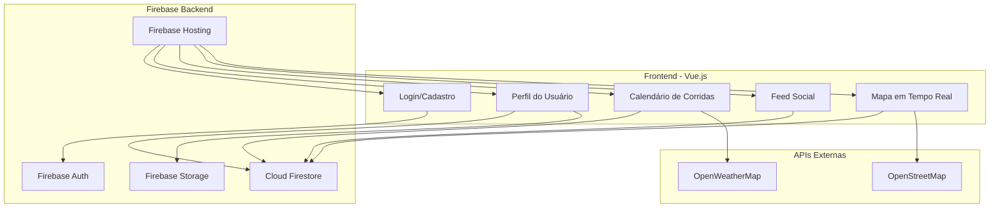
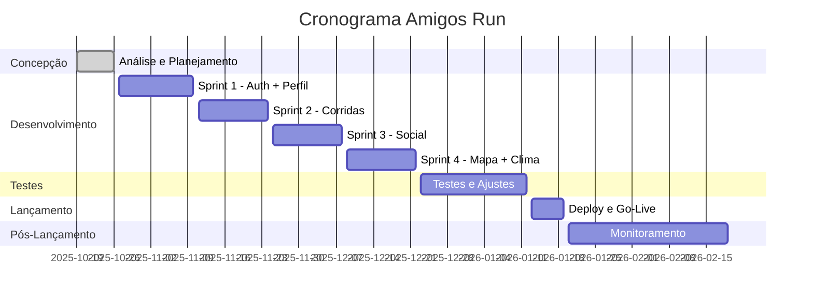

# Amigos Run - Documento de Concepção

<div align="center">

## Plataforma Web de Corridas Sociais - Concepção e Planejamento

[](https://datametria.io)
[](https://datametria.io)
[](https://datametria.io)
[](https://vuejs.org)
[](https://firebase.google.com)

[🎯 Visão](#-visão-do-projeto) • [📋 Escopo](#-escopo-e-objetivos) • [🏗️ Arquitetura](#️-arquitetura-proposta) •
[📅 Cronograma](#-cronograma-e-marcos) • [👥 Equipe](#-equipe-e-recursos)

</div>

---

## 📋 Informações Básicas

| Campo | Valor |
|-------|-------|
| **Nome do Projeto** | Amigos Run |
| **Código do Projeto** | PROJ-2025-001 |
| **Sponsor** | Dalila Rodrigues |
| **Product Owner** | Dalila Rodrigues |
| **Tech Lead** | Dalila Rodrigues |
| **Data de Concepção** | 19/10/2025 |
| **Prazo Estimado** | 19/02/2026 |
| **Orçamento Estimado** | R$ 0,00 (100% gratuito) |
| **Prioridade** | Alta |
| **Categoria** | Web App Social |
| **Complexidade** | Média |

---

## 🎯 Visão do Projeto

### Problema a Resolver

#### Contexto
Corredores amadores enfrentam dificuldades para encontrar eventos de corrida, conectar-se com outros corredores e acompanhar informações relevantes como clima e localização em tempo real.

#### Dor Identificada
- **Descoberta de eventos**: Informações espalhadas em múltiplas plataformas
- **Conexão social**: Falta de interação entre corredores
- **Informações práticas**: Ausência de dados sobre clima e localização
- **Organização pessoal**: Dificuldade para gerenciar participações

#### Impacto Atual
- **Tempo**: 2-3 horas/semana procurando eventos
- **Engajamento**: 40% dos corredores correm sozinhos
- **Informação**: 60% chegam despreparados (clima/local)
- **Comunidade**: Falta de networking entre corredores

### Solução Proposta

#### Visão Geral
Plataforma web social que centraliza eventos de corrida, conecta corredores e fornece informações práticas em tempo real (clima, localização, interação social).

#### Valor Agregado
- **Corredores**: Descoberta fácil de eventos e conexão social
- **Organizadores**: Maior visibilidade e engajamento
- **Comunidade**: Fortalecimento do ecossistema de corrida

#### Diferencial Competitivo
- **100% gratuito** (sem custos operacionais)
- **Foco social** (interação entre participantes)
- **Dados em tempo real** (clima e localização)
- **Interface simples** e intuitiva

---

## 📋 Escopo e Objetivos

### Objetivos SMART

| Objetivo | Meta | Prazo |
|----------|------|-------|
| **Lançar MVP** | Plataforma funcional com features core | 4 meses |
| **Base de usuários** | 100 usuários ativos | 6 meses |
| **Eventos cadastrados** | 50 corridas/mês | 6 meses |
| **Engajamento** | 70% usuários interagem no feed | 6 meses |

### Escopo do Projeto

#### ✅ Dentro do Escopo

**Core Features:**
- **Autenticação**: Login/cadastro com confirmação de email
- **Perfil**: Foto, dados pessoais, metas, biografia
- **Calendário**: Visualização mensal de corridas
- **Gestão de corridas**: Adicionar, visualizar, inscrever-se
- **Sistema social**: "Vou/Não vou" com visibilidade pública
- **Feed**: Interação textual entre corredores
- **Mapa**: Localização de eventos e corredores em tempo real
- **Clima**: Previsão do tempo para eventos

**Tecnologias:**
- Frontend: Vue.js 3 + Vite
- Backend: Firebase (Auth, Firestore, Storage, Hosting)
- Mapas: OpenStreetMap + Leaflet
- Clima: OpenWeatherMap API

#### ❌ Fora do Escopo

- Aplicativo mobile nativo
- Sistema de pagamentos
- Chat privado entre usuários
- Integração com wearables
- Ranking/gamificação
- Notificações push

#### 🔄 Escopo Futuro (Roadmap)

- **Fase 2**: App mobile (PWA)
- **Fase 3**: Sistema de pagamentos
- **Fase 4**: Gamificação e rankings

---

## 👥 Stakeholders e Usuários

### Personas dos Usuários

#### Persona 1: Corredor Iniciante
- **Perfil**: 25-35 anos, começando a correr
- **Objetivos**: Encontrar eventos adequados ao nível
- **Dores**: Não sabe onde encontrar corridas, medo de não conseguir
- **Necessidades**: Informações claras, comunidade acolhedora

#### Persona 2: Corredor Experiente
- **Perfil**: 30-50 anos, corre há anos
- **Objetivos**: Descobrir novos eventos, conectar com outros
- **Dores**: Eventos repetitivos, falta de networking
- **Necessidades**: Variedade de eventos, conexões sociais

#### Persona 3: Organizador de Eventos
- **Perfil**: 35-55 anos, organiza corridas
- **Objetivos**: Divulgar eventos, aumentar participação
- **Dores**: Baixa visibilidade, dificuldade de comunicação
- **Necessidades**: Plataforma de divulgação, feedback dos participantes

---

## 🏗️ Arquitetura Proposta

### Stack Tecnológico 100% Gratuita

#### Frontend
- **Framework**: Vue.js 3.3+ com Composition API
- **Build Tool**: Vite 5.0+
- **State Management**: Pinia 2.1+
- **Routing**: Vue Router 4.2+
- **Mapas**: Leaflet 1.9+ com OpenStreetMap

#### Backend
- **Authentication**: Firebase Auth
- **Database**: Cloud Firestore
- **Storage**: Firebase Storage (fotos de perfil)
- **Hosting**: Firebase Hosting

#### APIs Externas
- **Clima**: OpenWeatherMap (1000 calls/dia gratuito)
- **Mapas**: OpenStreetMap (ilimitado gratuito)

### Diagrama de Arquitetura



### Estrutura do Firestore

```
users/{uid}
├── name, email, photoUrl
├── peso, altura, meta, biografia
└── corridasInscritas[]

corridas/{runId}
├── titulo, data, local{endereco, cidade, lat, lng}
├── linkInscricao, valor
└── createdBy, createdAt

corridas/{runId}/presencas/{uid}
├── status: "vou" | "nao_vou"
├── userName
└── updatedAt

feed/{postId}
├── userId, userName, texto
├── runId (opcional)
└── createdAt

locations/{uid}
├── lat, lng, userName
├── isActive
└── updatedAt
```

---

## 📊 Análise de Riscos

### Matriz de Riscos

| Risco | Probabilidade | Impacto | Mitigação |
|-------|---------------|---------|-----------|
| **Limite APIs gratuitas** | Média | Alto | Cache inteligente + monitoramento |
| **Baixa adoção inicial** | Alta | Médio | Marketing orgânico + MVP focado |
| **Problemas de performance** | Baixa | Médio | Otimização contínua + testes |
| **Concorrência** | Média | Baixo | Foco no diferencial social |

### Plano de Contingência

#### Risco 1: Estouro de Limites de API
- **Trigger**: 80% do limite mensal atingido
- **Ação**: Implementar cache mais agressivo + alertas
- **Alternativa**: Migrar para APIs pagas se necessário

#### Risco 2: Baixa Adoção
- **Trigger**: < 20 usuários em 2 meses
- **Ação**: Revisão de UX + marketing direcionado
- **Alternativa**: Pivot para nicho específico

---

## 📅 Cronograma e Marcos

### Fases do Projeto



### Marcos Principais

| Marco | Data | Entregável | Responsável |
|-------|------|------------|-------------|
| **M1 - Concepção** | 26/10 | Documento aprovado | Dalila |
| **M2 - Auth MVP** | 10/11 | Login funcionando | Dalila |
| **M3 - Core MVP** | 08/12 | Features principais | Dalila |
| **M4 - Beta** | 12/01 | Versão completa | Dalila |
| **M5 - Launch** | 19/01 | Go-live público | Dalila |

---

## 👥 Equipe e Recursos

### Estrutura da Equipe

| Papel | Nome | Responsabilidades | Dedicação |
|-------|------|------------------|-----------|
| **Product Owner** | Dalila Rodrigues | Visão do produto, requisitos | 20% |
| **Tech Lead** | Dalila Rodrigues | Arquitetura, desenvolvimento | 80% |
| **Designer** | Dalila Rodrigues | UX/UI, protótipos | 10% |

### Recursos Necessários

#### Infraestrutura (100% Gratuita)
- **Firebase**: Spark Plan (gratuito)
- **OpenWeatherMap**: Free tier (1000 calls/dia)
- **OpenStreetMap**: Gratuito ilimitado
- **Domínio**: Firebase subdomain (gratuito)

#### Ferramentas
- **Desenvolvimento**: VS Code (gratuito)
- **Design**: Figma (gratuito)
- **Versionamento**: GitHub (gratuito)
- **Monitoramento**: Firebase Analytics (gratuito)

---

## 💰 Análise Financeira

### Investimento Total: R$ 0,00

#### Custos de Desenvolvimento
- **Recursos Humanos**: Projeto pessoal (sem custo)
- **Infraestrutura**: 100% gratuita
- **Ferramentas**: 100% gratuitas
- **APIs**: Free tiers suficientes para MVP

#### Custos Operacionais
- **Hospedagem**: R$ 0,00 (Firebase gratuito)
- **APIs**: R$ 0,00 (dentro dos limites gratuitos)
- **Domínio**: R$ 0,00 (subdomínio Firebase)
- **Manutenção**: R$ 0,00 (projeto pessoal)

### Escalabilidade de Custos

| Usuários | Firestore Reads | OpenWeather | Custo Mensal |
|----------|----------------|-------------|--------------|
| **0-100** | < 50k/dia | < 1000/dia | R$ 0,00 |
| **100-500** | < 200k/dia | < 3000/dia | R$ 0,00 |
| **500+** | > 200k/dia | > 3000/dia | ~R$ 50,00 |

---

## 📈 Critérios de Sucesso

### Métricas Quantitativas

| Métrica | Meta 3 meses | Meta 6 meses |
|---------|--------------|--------------|
| **Usuários cadastrados** | 50 | 100 |
| **Corridas cadastradas** | 20 | 50 |
| **Posts no feed** | 100 | 500 |
| **Sessões/usuário** | 3/mês | 5/mês |
| **Tempo médio sessão** | 5 min | 8 min |

### Métricas Qualitativas
- ✅ **Usabilidade**: Interface intuitiva e responsiva
- ✅ **Performance**: Carregamento < 3 segundos
- ✅ **Confiabilidade**: 99% uptime
- ✅ **Satisfação**: Feedback positivo dos usuários

---

## 🔗 Próximos Passos

### Imediatos (1 semana)
1. **Setup do projeto**: Vue.js + Firebase
2. **Prototipação**: Wireframes das telas principais
3. **Configuração**: Ambiente de desenvolvimento

### Sprint 1 (2 semanas)
1. **Autenticação**: Login/cadastro com email
2. **Perfil básico**: CRUD de dados do usuário
3. **Layout**: Estrutura base da aplicação

### Sprint 2 (2 semanas)
1. **Corridas**: CRUD de eventos
2. **Calendário**: Visualização mensal
3. **Clima**: Integração OpenWeatherMap

### Sprint 3 (2 semanas)
1. **Sistema social**: Vou/Não vou
2. **Feed**: Posts e interações
3. **Notificações**: Feedback visual

### Sprint 4 (2 semanas)
1. **Mapa**: Integração Leaflet
2. **Localização**: Tempo real
3. **Polimento**: UX/UI final

---

## 🎯 Visão de Longo Prazo

### 6 meses: MVP Consolidado
- Base sólida de usuários (100+)
- Features core funcionando perfeitamente
- Feedback positivo da comunidade

### 1 ano: Expansão
- PWA para mobile
- Integração com redes sociais
- Sistema de recomendações

### 2 anos: Plataforma Estabelecida
- Monetização via premium features
- Parcerias com organizadores
- Expansão para outras modalidades

---

<div align="center">

**Desenvolvido por**: Dalila Rodrigues
**Data**: 19/10/2025
**Versão**: 1.0.0

---

## Projeto Amigos Run - Conectando corredores! 🏃‍♂️🏃‍♀️

</div>